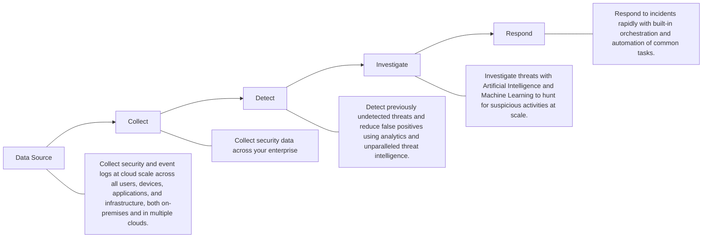

# Exploring Kusto Query Language (KQL)

## Introduction

This lab focuses on creating a walkthrough for understanding the power of Kusto “KQL integration with MS Sentinel. The room introduces learners to the analysis of security logs with Microsoft Sentinel KQl. As a security engineers, we think of security logs as treasures because they can help us discover the hidden activities within our infrastructure. Microsoft Sentinel is a cloud native Security information and Event Management (SIEM) product that utilizes ingested logs to provide better visibility into your environment. On the other hand, Kusto Query Language (KQL) is the tool used to proactively reveal the hidden secrets within those logs if you are the curious and hands-on-type.

Imagine been able to:

* Track down rogue user activities accurately and identify potential breaches before the happen
* Unravel complex security incidents by correlating events and figuring out every attacker’s moves
* Automating repeated tasks to focus on more serious threats and investigations.

This walkthrough focuses on KQL which empowers us the security analyst/engineer to become security sleuth, proactively hunting for threats to ensure your organization’s digital infrastructure is safe from attackers. Therefore, I am diving into the works of KQL to discover the power of security logs analysis.

Figure 1

At the end of this walkthrough, readers will be provided with the fundamental knowledge and skills necessary to use Kusto Query Language (KQL) for security analysis within MS Sentinel Log Analytics workspace.

* Better understand the core concepts and functionalities of Microsoft Sentinel as a Security Information and Event Management (SIEM) solution.
* Easily understand the benefits of using Kusto Query Language (KQL) in Microsoft Sentinel for day-to-day security operations.
* Understand how KQL interacts with data stored within MS Sentinel Log Analytics workspaces and its uses in querying and analyzing them.

# Overview of Microsoft Sentinel
Let’s put Microsoft Sentinel into perspective before because having a better understanding of it is essential before delving into Kusto Query Language.
The cloud computing space is continuously growing, and cyber criminals are always prowling in the shadows, waiting to catch the security team unaware. Organizations with MS Sentinel properly configured are always on guard, protecting themselves against malicious attackers and working restlessly to keep their digital infrastructure safe from all cyber threats.

# Microsoft Sentinel Workflow

Figure 2: Microsoft Sentinel Workflow

# Microsoft Sentinel Explained

MS Sentinel is a cloud-native Security Information and Event Management (SIEM) solution enabling security administrators to better detect, investigate, and respond to security threats across their enterprise environment. Sentinel is built on top of Azure, providing a centralized platform for security monitoring, log collection, threat detection, response, and investigation. It is not only a SIEM solution but also a Security Orchestration, Automation, and Response (SOAR) solution, which enhances its capabilities.

MS Sentinel can integrate seamlessly with Microsoft and third-party services to create a comprehensive security ecosystem for threat intelligence and security operations in the cloud or on-premise.

## Integration with Microsoft Services

MS Sentinel offers prebuilt connectors for easy integrations with various Microsoft security services, eliminating complex configurations needs. Below are a few key integrations with other Microsoft services.

* Microsoft Entra ID: Sentinel integrates with Entra ID for identity protection, identity and access management, and threat detection. You will be able to monitor user activities, filter audit logs, identify suspicious login attempts, and enforce Conditional Access Policies if configured.

* Microsoft Defender: When Sentinel is integrated with Microsoft Defender suite, it expands its threat detection capabilities to several Azure resources such as virtual machines, databases, and containers. This integration allows Sentinel to use Defender’s advanced threat protection features for a more comprehensive security analysis. For instance, collecting endpoint security logs to detect and isolate devices with malware or even initiate an automated response

* Azure Logic Apps: Sentinel can leverage Azure Logic Apps to automate response and remediation workflows. This enables the harmonization of complex responses across different services when a threat is detected

* Azure Monitor: Integrating Azure Monitor with Sentinel allows the ingestion of metrics and logs from various Microsoft services, generating comprehensive security insights and analytics

Microsoft Sentinel can also use agent-based log collection tools for servers hosted on-premises or in the cloud, providing a big-eye view of your security.

## Integration with Third-Party Services

Microsoft has a library of built-in data connectors for third-party security products to simplify log ingestion by handling the data format and communication protocols, allowing seamless ingestion. A few examples of

The third-party products include but are not limited to Palo Alto Networks, CrowdStrike, Fortinet, MacAfee, Splunk, AWS, and more.

* Syslog Integration: Syslog is a widely used standard for transmitting logs. Sentinel can ingest security data from various devices, servers, and applications that support Syslog forma, providing flexibility when integrating a wide range of security logs.

* REST API Integration: Sentinel offers an alternative REST API for security solutions not covered by built-in connectors. This option may require experts to build custom scripts or applications that interact with the service API to transmit data Microsoft Sentinel

## Note
It's worth knowing that Microsoft Sentinel utilizes Azure Log Analytics workspaces to store data logs. These logs may include Microsoft services such as Office 365, Microsoft Defender, and Azure activities, as well as third-party logs like firewall logs, network logs, SaaS application logs, and more.

## Questions

* In addition to being a SIEM solution, what else is Microsoft Sentinel?

Answer: SOAR

* How does MS Sentinel support other security solutions that are not included in the built-in connectors?

Answer: REST API integration

## Task 3

## Kusto Query Language (KQL)

Kusto Query Language is the key to unlocking the full potential of Microsoft Sentinel and will help you transform raw security events into actionable insights, giving you a competitive advantage against malicious actors. KQL is more than just a syntax. Within the context of Microsoft Sentinel, it is a tool for discovering and ingesting suspicious activities. With each query, you can sift through large amounts of logs, detect subtle traces of cyber threats, and connect the dots to get actionable insights from the logs across your digital estate.

## KQL in Action

As cyber threats continue to become sophisticated, MS Sentinel is always ready for action. It gives you insights into all malicious activities and uses the power of KQL to reveal suspicious movements in tables and charts.

Figure 3

With each query, the output gives more insight into every malicious activity, which the security team can then act upon to fortify the defenses of their digital estate.
# KQL Explained
Kusto Query Language is developed by Microsoft to query large amounts of structured, semi-structured, and unstructured data. It was initially created for Azure Data Explorer but has been widely adopted across various Microsoft services, including Azure Monitor, Azure Sentinel, Microsoft 365 Defender, and more. It is worth knowing that KQL queries run against a log repository where the ingested logs are stored, in this case, a Log Analytics workspace.
A simple description of KQL would be that it is a:
1. Security analysis language: Used to filter, search, and analyze security logs and events.
2. Powerful and flexible tool: Used to run simple and complex queries to extract detailed security insights.
3. Tool for large datasets: Optimized for handling massive amounts of security logs.
4. Tool built-in for Microsoft Sentinel: Seamless integrated for data exploration and threat hunting.

5. Tool used in other Microsoft services: Such as Azure Data Explorer, Log Analytics, Azure Monitor, and Azure Sentinel.

In the hands of vigilant security administrators, KQL will help reveal areas where threats may be hiding within the infrastructure and, in turn, bringing the team peace of mind.

## Kusto Query Language Editor

Figure 4: KQL Query

## Example of KQL Query

Below is what KQL query may look like:

Heartbeat
| summarize AggregatedHeartbeatCount = count() by Computer
| order by AggregatedHeartbeatCount desc
| take 10

Figure 5: KQL Query

# Explanation
* This query retrieves data from the Heartbeat table, which typically contains information about the health and status of devices or systems within the organization.
* Then, the summarize operator aggregates the data by counting the number of heartbeats for each unique computer.
* The result is then outputted in descending order based on the aggregated heartbeat count.
* Finally, the take operator limits the output to the top 10 computers with the highest heartbeats.

## Questions

* What initial service was KQL created for?

Answer: Azure Data Explorer

* Analyze the example query from the task. How many computers will the query return?

Answer: 10 Computers

* What table is the example query retrieving its data from?

Answer: Heartbeat Table

# KQL Concepts in Microsoft Sentinel

Now that we have been introduced to MS Sentinel and KQL, we need to familiarize ourselves with some key concepts to fully grasp how KQL works query and analyze ingested logs.

## Table

Since the log repository (Log Analytics workspace) uses tables to manage the various kinds of logs ingested, each table is usually associated with a specific data source. For instance:

* Security event logs (SecurityEvent)
* Azure activity logs (AzureActivity)
* Windows firewall logs (WindowsFirewall)
* Network monitoring logs (NetworkMonitoring)
* or any custom data sources.

These tables are what you query when you run a KQL query. Note: Custom logs are identified with _CL at the end of the name

Figure 6: Custom Logs

Custom Logs

AzureNetworkAnalytics_CL
AzureNetworkAnalyticsIPDetai..
ManagementPackHistory_CL
ServiceMapComputer_CL
ServiceMapProcess_CL
WorkloadEvents_CL
WorkloadHealthState_CL
WorkloadPerformance_CL

# Example

Figure 7: KQL Query

The query above shows all the security events from the SecurityEvent log table for the past 24 hours.

# Functions and Operators

Functions and operators are symbols or keywords that carry out operations, such as performing specific tasks or calculations on ingested logs. They are used to manipulate, aggregate, filter, transform, or analyze data and are usually invoked by name or customized parameters.

## Examples

count(), sum(), avg(), where(), parse()
== - (equal to)
!= - (not equal to)
< - (less than)
render
summarize
`|` - (Pipeline)

## Expressions

Expressions are combinations of values, functions, operators, and table names that evaluate a single meaningful unit. It defines conditions, calculations, transformations, and other operations.

## Example

Figure 8: KQL Query

Figure 9: KQL Query table

Figure 10: KQL Query table

# Explanation

<table>
  <thead>
    <tr>
        <th>Operator/Function Name</th>
        <th>Description</th>
        <th>Example</th>
    </tr>
  </thead>
  <tbody>
    <tr>
        <td>search</td>
        <td>Searches the specified table for matching value or pattern</td>
        <td>search "failed"</td>
    </tr>
    <tr>
        <td>where</td>
        <td>Filters the specified table based on specified conditions</td>
        <td>SigninLogs | where EventID == "4624"</td>
    </tr>
    <tr>
        <td>take</td>
        <td>Used to limit the number of returned rows in the result set</td>
        <td>SigninLogs | take 5</td>
    </tr>
    <tr>
        <td>sort</td>
        <td>Sort records in ascending or descending order based on the specified column</td>
        <td>SigninLogs | sort by TimeGenerated, Identity desc | take 5</td>
    </tr>
    <tr>
        <td>ago</td>
        <td>Returns the time offset relative to the time the query executes</td>
        <td>ago(1h)</td>
    </tr>
    <tr>
        <td>print</td>
        <td>Outputs a single row with one or more scalar expressions</td>
        <td>print bin(4.5, 1)</td>
    </tr>
    <tr>
        <td>project</td>
        <td>Selects specific columns from a table</td>
        <td>Perf | project ObjectName, CounterValue, CounterName</td>
    </tr>
    <tr>
        <td>extend</td>
        <td>Used to create a new calculated column and add it to the result set</td>
        <td>Perf | extend AlertThreshold = 80</td>
    </tr>
    <tr>
        <td>count</td>
        <td>Calculates the number of records in a table</td>
        <td>SecurityAlert | count()</td>
    </tr>
  </tbody>
</table>

# KQL quick reference

This article shows a list of functions and their descriptions to help drive me deeper into using Kusto Query Language.

Expand table

<table>
  <thead>
    <tr>
        <th>Operator/Function</th>
        <th>Description</th>
        <th>Syntax</th>
    </tr>
  </thead>
  <tbody>
    <tr>
        <td>Filter/Search/Condition</td>
        <td>Find relevant data by filtering or searching</td>
        <td> </td>
    </tr>
    <tr>
        <td>where</td>
        <td>Filters on a specific predicate</td>
        <td>T | where Predicate</td>
    </tr>
    <tr>
        <td>where contains/has</td>
        <td>Contains: Looks for any substring match Has: Looks for a specific word (better performance)</td>
        <td>T | where col1 contains/has "[search term]"</td>
    </tr>
  </tbody>
</table>

<table>
  <thead>
    <tr>
        <th>Operator/Function</th>
        <th>Description</th>
        <th>Syntax</th>
    </tr>
  </thead>
  <tbody>
    <tr>
        <td>search</td>
        <td>Searches all columns in the table for the value</td>
        <td>[TabularSource |] search [kind=CaseSensitivity] [in (TableSources)] SearchPredicate</td>
    </tr>
    <tr>
        <td>take</td>
        <td>Returns the specified number of records. Use to test a query. <em>Note:</em> take and limit are synonyms.</td>
        <td>T | take NumberOfRows</td>
    </tr>
    <tr>
        <td>case</td>
        <td>Adds a condition statement, similar to if/then/elseif in other systems.</td>
        <td>case(predicate_1, then_1, predicate_2, then_2, predicate_3, then_3, else)</td>
    </tr>
    <tr>
        <td>distinct</td>
        <td>Produces a table with the distinct combination of the provided columns of the input table</td>
        <td>distinct [ColumnName], [ColumnName]</td>
    </tr>
    <tr>
        <th>Date/Time</th>
        <th>Operations that use date and time functions</th>
        <th> </th>
    </tr>
    <tr>
        <td>ago</td>
        <td>Returns the time offset relative to the time the query executes. For example, ago(1h) is one hour before the current clock's reading.</td>
        <td>ago(a_timespan)</td>
    </tr>
    <tr>
        <td>format_datetime</td>
        <td>Returns data in various date formats.</td>
        <td>format_datetime(datetime , format)</td>
    </tr>
    <tr>
        <td>bin</td>
        <td>Rounds all values in a timeframe and groups them</td>
        <td>bin(value,roundTo)</td>
    </tr>
    <tr>
        <th>Create/Remove Columns</th>
        <th>Add or remove columns in a table</th>
        <th> </th>
    </tr>
    <tr>
        <td>print</td>
        <td>Outputs a single row with one or more scalar expressions</td>
        <td>print [ColumnName =] ScalarExpression [', ...]</td>
    </tr>
    <tr>
        <td>project</td>
        <td>Selects the columns to include in the order specified</td>
        <td>T | project ColumnName [= Expression] [, ...] Or T | project [ColumnName [(ColumnName[,]) =] Expression [, ...]</td>
    </tr>
    <tr>
        <td>project-away</td>
        <td>Selects the columns to exclude from the output</td>
        <td>T | project-away ColumnNameOrPattern [, ...]</td>
    </tr>
    <tr>
        <td>project-keep</td>
        <td>Selects the columns to keep in the output</td>
        <td>T | project-keep ColumnNameOrPattern [, ...]</td>
    </tr>
  </tbody>
</table>

<table>
  <thead>
    <tr>
        <th>Operator/Function</th>
        <th>Description</th>
        <th>Syntax</th>
    </tr>
  </thead>
  <tbody>
    <tr>
        <td>project-rename</td>
        <td>Renames columns in the result output</td>
        <td>T | project-rename new_column_name = column_name</td>
    </tr>
    <tr>
        <td>project-reorder</td>
        <td>Reorders columns in the result output</td>
        <td>T | project-reorder Col2, Col1, Col* asc</td>
    </tr>
    <tr>
        <td>extend</td>
        <td>Creates a calculated column and adds it to the result set</td>
        <td>T | extend [ColumnName | (ColumnName[, ...]) =] Expression [, ...]</td>
    </tr>
    <tr>
        <td><strong>Sort and Aggregate Dataset</strong></td>
        <td><em>Restructure the data by sorting or grouping them in meaningful ways</em></td>
        <td> </td>
    </tr>
    <tr>
        <td>sort operator</td>
        <td>Sort the rows of the input table by one or more columns in ascending or descending order</td>
        <td>T | sort by expression1 [asc|desc], expression2 [asc|desc], ...</td>
    </tr>
    <tr>
        <td>top</td>
        <td>Returns the first N rows of the dataset when the dataset is sorted using by</td>
        <td>T | top numberOfRows by expression [asc|desc] [nulls first|last]</td>
    </tr>
    <tr>
        <td>summarize</td>
        <td>Groups the rows according to the by group columns, and calculates aggregations over each group</td>
        <td>T | summarize [[Column =] Aggregation [, ...]] [by [Column =] GroupExpression [, ...]]</td>
    </tr>
    <tr>
        <td>count</td>
        <td>Counts records in the input table (for example, T) This operator is shorthand for summarize count()</td>
        <td>T | count</td>
    </tr>
    <tr>
        <td>join</td>
        <td>Merges the rows of two tables to form a new table by matching values of the specified column(s) from each table. Supports a full range of join types: fullouter, inner, innerunique, leftanti, leftantisemi, leftouter, leftsemi, rightanti, rightantisemi, rightouter, rightsemi</td>
        <td>LeftTable | join [JoinParameters] ( RightTable ) on Attributes</td>
    </tr>
    <tr>
        <td>union</td>
        <td>Takes two or more tables and returns all their rows</td>
        <td>[T1] | union [T2], [T3], ...</td>
    </tr>
    <tr>
        <td>range</td>
        <td>Generates a table with an arithmetic series of values</td>
        <td>range columnName from start to stop step step</td>
    </tr>
    <tr>
        <td><strong>Format Data</strong></td>
        <td><em>Restructure the data to output in a useful way</em></td>
        <td> </td>
    </tr>
  </tbody>
</table>

<table>
  <thead>
    <tr>
        <th colspan="3">Operator/Function</th>
        <th>Description</th>
        <th>Syntax</th>
    </tr>
  </thead>
  <tbody>
    <tr>
        <td>lookup</td>
        <td>Extends the columns of a fact table with values looked-up in a dimension table</td>
        <td>T1 | lookup [kind = (leftouter|inner)] ( T2 ) on Attributes</td>
        <td colspan="2"></td>
    </tr>
    <tr>
        <td>mv-expand</td>
        <td>Turns dynamic arrays into rows (multi-value expansion)</td>
        <td>T | mv-expand Column</td>
        <td colspan="2"></td>
    </tr>
    <tr>
        <td>parse</td>
        <td>Evaluates a string expression and parses its value into one or more calculated columns. Use for structuring unstructured data.</td>
        <td>T | parse [kind=regex [flags=regex_flags] |simple|relaxed] Expression with * (StringConstant ColumnName [: ColumnType]) *...</td>
        <td colspan="2"></td>
    </tr>
    <tr>
        <td>make-series</td>
        <td>Creates series of specified aggregated values along a specified axis</td>
        <td>T | make-series [MakeSeriesParamters] [Column =] Aggregation [default = DefaultValue] [, ...] on AxisColumn from start to end step step [by [Column =] GroupExpression [, ...]]</td>
        <td colspan="2"></td>
    </tr>
    <tr>
        <td>let</td>
        <td>Binds a name to expressions that can refer to its bound value. Values can be lambda expressions to create query-defined functions as part of the query. Use let to create expressions over tables whose results look like a new table.</td>
        <td>let Name = ScalarExpression | TabularExpression | FunctionDefinitionExpression</td>
        <td colspan="2"></td>
    </tr>
    <tr>
        <td>General</td>
        <td><em>Miscellaneous operations and function</em></td>
        <td> </td>
        <td colspan="2"></td>
    </tr>
    <tr>
        <td>invoke</td>
        <td>Runs the function on the table that it receives as input.</td>
        <td>T | invoke function([param1, param2])</td>
        <td colspan="2"></td>
    </tr>
    <tr>
        <td>evaluate pluginName</td>
        <td>Evaluates query language extensions (plugins)</td>
        <td>[T |] evaluate [ evaluateParameters ] PluginName ( [PluginArg1 [, PluginArg2]... )</td>
        <td colspan="2"></td>
    </tr>
    <tr>
        <td>Visualization</td>
        <td><em>Operations that display the data in a graphical format</em></td>
        <td> </td>
        <td colspan="2"></td>
    </tr>
    <tr>
        <td>render</td>
        <td>Renders results as a graphical output</td>
        <td>T | render Visualization [with (PropertyName = PropertyValue [, ...] )]</td>
        <td colspan="2"></td>
    </tr>
  </tbody>
</table>

# Note
The pipe | separates each line of the query.

In summary, functions and operators are either symbols or keywords that perform operations on ingested logs, while expressions are a combination of values, functions, and operators that evaluate a single unit. These elements are essential to KQL, enabling security analysts to analyze and manipulate security logs effectively.

## Questions

* What operator can be used to output results in graphical form?

Answer: render

* What operator can be used to filter a specified table based on specified conditions?

Answer: Where

* What user account name was queried in our second example query above?

Answer: JBOX00$

## Task 5

# KQL Statement Structure

## The Structure

In the previous task, we discussed some key concepts when writing a KQL query. Let's combine them to make a statement.

The structure of a KQL statement consists of multiple components, allowing you to retrieve, manipulate, and analyze security logs effectively. You start with a data source and navigate through a set of operators bound together using the pipe | delimiter.

Below is a typical example of a query combining multiple query components

<table>
  <thead>
    <tr>
        <th colspan="3">SecurityEvent</th>
    </tr>
  </thead>
  <tbody>
    <tr>
        <td></td>
        <td>where TimeGenerated &gt; ago(1d)</td>
        <td></td>
    </tr>
    <tr>
        <td></td>
        <td>summarize EventCount = count() by Computer</td>
        <td></td>
    </tr>
    <tr>
        <td></td>
        <td>order by EventCount desc</td>
        <td>limit 10</td>
    </tr>
  </tbody>
</table>

Figure 11: KQL Query

# Explanation
* Data source: The data source specifies the table from which you want to retrieve data.
  * SecurityEvent - Specifies the table from which data will be retrieved.
* Conditions: They are used to perform specific actions on data.
  * `where TimeGenerated > ago(1d)` - Filters the data to include only events that occurred within the last 24 hours `ago(1d)`. This ensures that only recent events are analyzed.
  * `summarize EventCount = count() by Computer` - Aggregates the filtered events by the `Computer` column and counts the number of events for each device.
* Ouput: This defines how you want to view the output result.
  * `order by EventCount desc` - Sorts the aggregated data by the `EventCount` column in descending order `desc`.
  * `limit 10` - Limits the output to the top 10 devices with the highest number of security events.

After understanding the query mentioned above, you can try it with the **Demo Log Analytics**(opens in new tab) and your lab credentials if prompted to sign in, as explained in Task 3. Also, remember to switch the mode to KQL.

Figure 12: KQL Query

# Questions

* What is the name of the table queried in our example query?

Answer: SecurityEvent

Analyze the example query from the task. What does the query aggregate per computer?

* Answer: EventCount

# KQL Use cases
Now that I have gotten clear insights into understanding the concept and structure of KQL queries, I intend to explore real-world scenarios to see how KQL can support me as a security analyst, in gaining deeper insights into security logs.

**Scenario:** Today at the office, you need to identify failed login attempts for a specific user account to investigate potential unauthorized access.

**Solution:** To identify failed login attempts, you can search the `SecurityEvent` table for failed login attempts using the query below. This will find all failed login attempts across your organization. You can modify the time range to expand your search.

<table>
  <tbody>
    <tr>
        <td>SecurityEvent</td>
        <td></td>
    </tr>
    <tr>
        <td></td>
        <td>where EventID == 4625</td>
    </tr>
  </tbody>
</table>

Figure 13: KQL Query

Then, to focus on failed login attempts for a specific user account, you can add a filter to the query, as shown below:
# SecurityEvent
`| where EventID == 4625 and TargetUserName contains "admin"`

Figure 14: KQL Query

You can also narrow down the results to see the failed login attempts in the past hour, as shown below:
<table>
  <thead>
    <tr>
        <th>SecurityEvent</th>
    </tr>
  </thead>
  <tbody>
    <tr>
        <td>where EventID == 4625 and TargetUserName contains "admin"</td>
    </tr>
    <tr>
        <td>where TimeGenerated &gt; ago(1h)</td>
    </tr>
  </tbody>
</table>

Figure 15: KQL query

Notice the progression of the query and how extra statements were applied to give us a refined and specific result; in the output above, there is no result for the past hour. This query can be modified in different ways to fit what we want to achieve. There's no limit to what you can do with KQL.
# KQL Technical Use Cases
Here are some technical KQL use cases in Microsoft Sentinel:
* Investigating security incidents: You can use KQL to analyze security alerts, identify the root cause of incidents, and investigate attack timelines by querying relevant logs.
* Hunting for malware: KQL queries can be used to detect anomalies and search for suspicious malware-related activities, such as malicious file downloads, unusual registry changes, or network manipulations.
* Detecting lateral movement: KQL can identify suspicious user logins from different devices or locations, which may indicate unauthorized access and lateral movement within your network.
* Monitoring user activity: As a security analyst, you can review login attempts, access patterns, and privileged user activity using KQL queries, which can help detect account misuse or compromises.
* Security operations automation: Security admins can automate security operations and incident response by integrating KQL queries into workflows and triggering alerts, notifications, or remedial actions based on query results.
* Alerting: In Microsoft Sentinel, custom alerts can be created using KQL queries to inform you of possible security events by specifying particular criteria in the query. Also, an alert rule can be created within KQL from a query.
* Log analysis and reporting: Additionally, you can use KQL queries to extract and analyze security logs, creating custom reports to determine your current security posture, usage and performance metrics, compliance requirements, and threat trends.

Figure 16: KQL query

## Questions

* What are we searching for in the SecurityEvent table on the first query?

Answer: failed login attempts

* Which operator was used on the second query to streamline our search to a range of user accounts from the Answer: TargetUserName column?

Answer: Contains

# Summary

MS Sentinel was discussed as a robust SIEM solution that enables organizations to easily identify, investigate, and respond to security threats. KQL, on the other hand, is an effective method of querying and analyzing security logs. When combined, they form a holistic security operations tool for securing modern digital infrastructure.

The more KQL is continuously explored, the more it is realized you'll discover its extensive capabilities for enhancing your organization's overall security posture.

# Learning Curve

To become a skilled security analyst and threat hunter, here are some pointers to get you going:

* Start simple:** Begin with basic queries to identify core security events, and gradually progress to more complex ones as you gain confidence.

* **Practice makes perfect:** The more you practice writing KQL queries, the more comfortable and proficient you'll become.

* **Unlock potential:** As your KQL proficiency grows, you can delve into advanced concepts like joins, parse, and user-defined functions. These offer even greater capabilities for complex data analysis and threat-hunting scenarios.

# Upcoming Project

My huge upcoming hands-on projects will be focusing on the Microsoft security products to understand how Extended Detection and Response (XDR) combines signals from the pillars below to detect and mitigate threats:

* Microsoft Defender XDR Threat Protection

* Microsoft Sentinel

* Creating KQL queries for Microsoft Sentinel
  
* Microsoft Defender for Endpoint threat mitigation

* Microsoft Defender for Cloud Apps

* Microsoft Purview threat mitigation

* Microsoft Security Copilot threat mitigation

